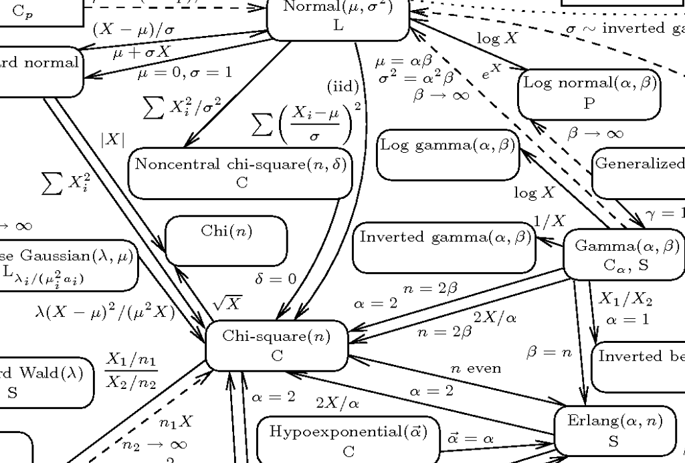

{fig-align="center"}

I have been working for the past month on developing a synthetic dataset to support the clinical trial our laboratory is starting in our search for a cure for HIV. Clearly, curing HIV is an ambitious goal. Our previous clinical trials and experiments have given us confidence that our approach will move us forward.

## What is a synthetic dataset? Why am I interested in such a thing?

A synthetic dataset is a set of hypothetical cases that mirror as closely as possible *in silico* (fancy word for on my computer) data that we are likely to collect from the real participants in our clinical trial. Synthetic datasets are useful when the process of collecting data is slow (our case) or the sample size is very restricted (as in the case of many animal model experiments where both ethics and cost limit how many animals can be sacrificed for an experimental result). In our case, we will replace our analyses conducted on the synthetic dataset with the results from the participants themselves.

The experimental protocol of any clinical trial tells us what variables will be collected. The synthetic dataset will use the same variables. Obviously, one can't simply make the data up. However, you see exactly this frequently in texts, blog posts or statistical package manuals. The authors will show examples of data predicated on a set of normally or uniformly distributed data, such as in the following example.[^1]

[^1]: The examples here will generally be generated in the R statistical language as that is what I generally use. However, this post will contain Python code as well.

```{r eval = FALSE}
# choose 100 random values between 18 and 65
age <- runif(n = 100, min = 18, max = 65) 
```

How we go about choosing data to use in a synthetic dataset requires more profound thinking for the set to be worthwhile. These values should mimic as closely as possible the real values we are likely to encounter in the clinical trial. We can only make values up out of whole cloth in a very few cases. Where do we find precedents for the variables we want to simulate? The principal source is prior studies or trials. They may not have the same objective or deal with exactly the same population as the real sample for the trial, but we need to make them "close enough" to make the analyses based on them reasonable approximations for the real data.

## Importance of Domain Knowledge

The analyst will have to apply their **domain knowledge** to the data to achieve reasonable values. Someone who is trying to create synthetic variables without understanding the real world factors applicable to that variable is unlikely to produce useful values. Below, I will show how I go about simulating the ages of a potential panel of people living with HIV ("PLHIV") in Brazil. I will discuss what we know from a previous study of a similar population, how that can be adjusted to reflect issues that were not included in the prior study, but are likely to play a part in a new study.

## The Problem Here - Fitting a Numerical Variable

The dataset I am creating has both categorical and numerical variables. In this post, I will focus on a single numerical variable - the age of participants in years. Our new clinical trial will be limited to adults between 18 and 65 years – a common range for clinical trials. What I want to do is to specify the statistical distribution that best describes the ages of 70 people (our `n`). I can then use that distribution to predict the ages of my 70 synthetic participants in the study.

## Our Precedent for the Age Variable

From 2017 - 2020, our lab conducted a smaller trial (30 individuals) of a similar strategy for HIV cure.[^2] I will refer to that study as `Cure1` for convenience. Among the demographic variables about the participants in that trial, we recorded the age in years at the beginning of the trial. These values are a good place to start. They describe a similar population and we will be using them in the same way in the new study. The only difference in the protocols of the studies is that the earlier study only included men and the new study will include everyone.

[^2]: A definitive summary of this trial is currently in the process of being published.

## Fitting a Distribution

One of the problems that data analysts confront regularly is how to describe a set of values, such as the `Cure1` age variable. We can list the values. With only 30 cases that is reasonable, but I'm not sure how we draw conclusions from a simple, unordered list. However, with 100, 1,000, or 500,000 cases, listing doesn't help us understand the data.

```{r cure1a, echo = FALSE}
pacman::p_load(tidyverse, ggsci)
cure1 <- readRDS('table1_cure1.rds')
age_cure1 <- cure1$age_years
age_cure1

```

We can summarize the data with measures of the centrality of the cases (their mean or median) and the variation around that central point as we normally do for variables.

```{r cure1b, echo = FALSE}
summarytools::descr(age_cure1, stats = "common", transpose = TRUE)
```

We can also graph the data with a density curve or a histogram. This is an appealing idea and it helps us to see the overall trends in the variable. Intuitively, we get a greater degree of satisfaction from the image.

```{r cure1c, echo = FALSE}
cure1 |>
  ggplot(aes(x = age_years)) +
  geom_histogram(aes(y = after_stat(density)), bins = 10, fill = "#155F83") +
  geom_density(color = "#FFA319") +
xlab("Age in Years") +
ylab("Density") +
  theme_bw()
```

## Distribution of the `age_years` Variable

The density curve of the age data appears monomodal; it has just one peak. The histogram, however, suggests that there is a second mode at the elderly end of the age spectrum. Picking a distribution that is an adequate model for projecting new cohorts of PLHIV who are likely to be enrolled in the new study is not obvious.

### Intuitive Distribution Selection

The dominant mode around 30 years old suggests visually that the distribution may be normal in character. That is our intuitive first guess about the type of data in the age variable. Testing normality is relatively straightforward. We can use either the Shapiro-Wilk or the Anderson-Darling tests of normality. In both cases, if the p-value of the test is less than a value we set, by custom 0.10 for normality tests, we consider that the normal distribution does not describe the data. Let's try those with our data.

```{r}

# Shapiro-Wilk
shapiro.test(age_cure1)

# Anderson-Darling
nortest::ad.test(age_cure1)
```

In both these tests, the age data does not appear to be normally, even for the more liberal Anderson-Darling test.

Now, what? We can continue to test continuous distributions and hope we find one that fits the pattern of our data. That's not very efficient and depends on our

## Note on the Illustration at the Head of the Post

The diagram at the beginning of this post is a small piece of an extraordinary illustration of the relationship among a large number of statistical distributions that is the main element of an article in **The American Statistician** from 2008 by Leemis and McQueston, *Univariate Distribution Relationships*. ([@leemis2008]) that the first author has enshrined in a web page that explains in detail each of the distributions and how they relate one to the other (<https://www.math.wm.edu/~leemis/chart/UDR/UDR.html>). This is a very valuable resource for anyone who is dealing with this subject.